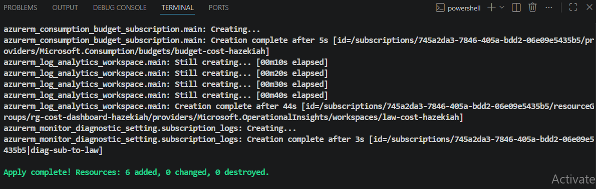
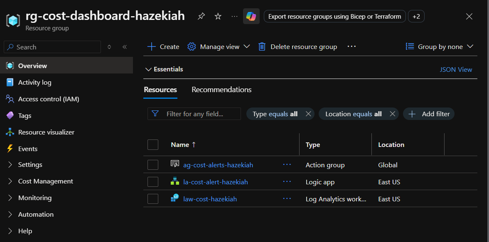
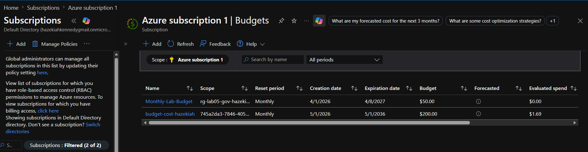
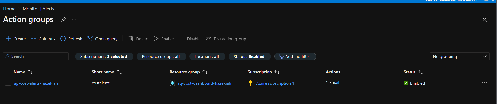
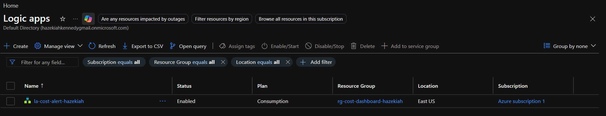
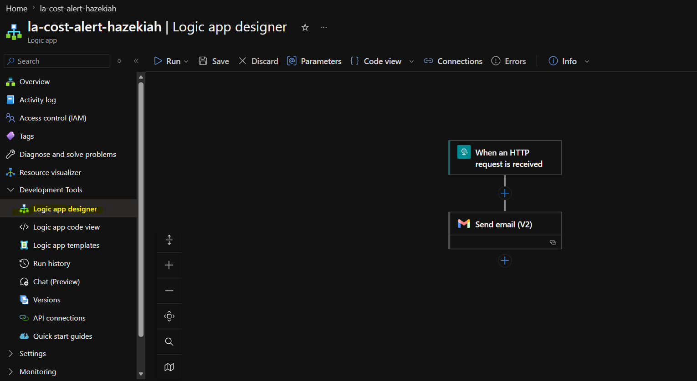
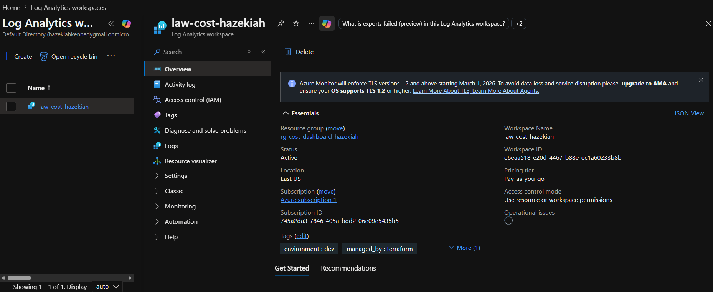
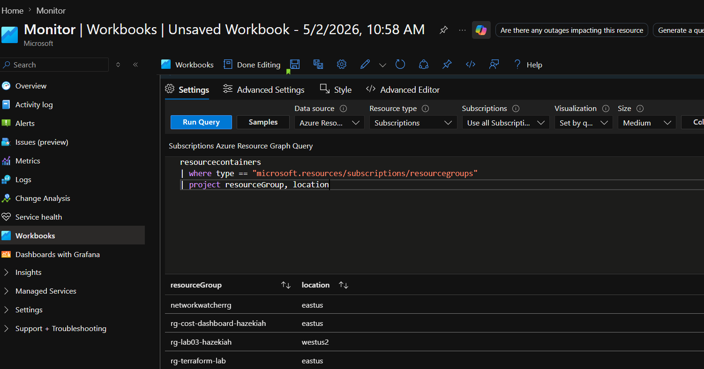
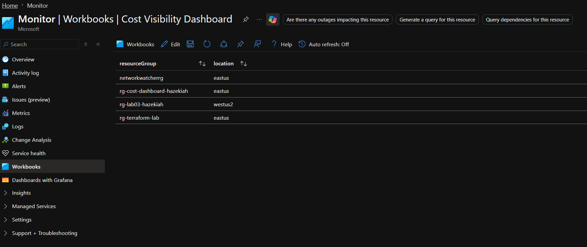

# Project 1 — Azure Cost Visibility Dashboard
*Azure Monitor · Logic Apps · Log Analytics · Azure Workbooks · Terraform*

| Field | Value |
|---|---|
| Certification alignment | AZ-900 · AZ-104 · Azure Administrator |
| Tools used | Terraform · Azure CLI · Azure Monitor · Logic Apps · Log Analytics · Azure Workbooks |
| Time to complete | 3–4 hours |
| Estimated cost | $0 — fully within Azure free tier |
| Career relevance | Cloud Engineer · DevOps Engineer · Cloud Administrator · FinOps |

---

## The Business Problem This Lab Solves

Most small businesses move to the cloud because someone told them it would be cheaper than managing their own servers. Then the bills start arriving — full of line items that nobody in the business can interpret, predict, or explain to anyone else.

This lab fixes that. The system built here:

- Tracks spending across all Azure services
- Fires automatic alerts when spending hits thresholds ($50, $100, $200)
- Sends email notifications via Logic Apps when an alert triggers
- Displays a dashboard in Azure Workbooks showing spend by service and resource group
- Generates a weekly comparison report showing what changed and where costs are trending

When describing this project in an interview lead with the business outcome: "I built a system that gives business owners real-time visibility into their Azure spend and alerts them before the bill becomes a problem."

---

## What Gets Built

| Resource | Name | Purpose |
|---|---|---|
| Resource Group | `rg-cost-dashboard-hazekiah` | Container for all lab resources |
| Log Analytics Workspace | `law-cost-hazekiah` | Stores diagnostic and activity data |
| Monitor Action Group | `ag-cost-alerts-hazekiah` | Sends email when alert fires |
| Consumption Budget | `budget-cost-hazekiah` | Watches for $50 / $100 / $200 spend |
| Logic App Workflow | `la-cost-alert-hazekiah` | Triggered by alert, formats and sends email |
| Azure Workbook | `Cost Visibility Dashboard` | Spending dashboard visible in the portal |

---

## Prerequisites

Make sure you have the following installed before starting. If you completed a previous lab these are already installed — skip to Step 1.

### Verify installations

```powershell
terraform --version
az --version
```

### Log in to Azure

```powershell
az login
az account set --subscription "Azure subscription 1"
az account show
```

---

## Folder Setup

```powershell
New-Item -ItemType Directory -Path "$HOME\cost-dashboard-001"
cd "$HOME\cost-dashboard-001"
```

---

## Step 1 — Write variables.tf

Create `variables.tf` in your project folder with this content:

```hcl
variable "yourname" {
  description = "Your name, lowercase, no spaces. Used to make resource names unique."
  type        = string
}

variable "location" {
  description = "Azure region to deploy into."
  type        = string
  default     = "East US"
}

variable "alert_email" {
  description = "Email address to receive cost alert notifications."
  type        = string
}

variable "tags" {
  type = map(string)
  default = {
    project     = "cost-dashboard"
    environment = "dev"
    managed_by  = "terraform"
  }
}
```

---

## Step 2 — Write terraform.tfvars

Create `terraform.tfvars` in your project folder:

```hcl
yourname    = "hazekiah"
location    = "East US"
alert_email = "hazekiah.kennedy@gmail.com"
```

---

## Step 3 — Write main.tf

Create `main.tf` in your project folder with this content:

```hcl
terraform {
  required_providers {
    azurerm = {
      source  = "hashicorp/azurerm"
      version = "~> 3.0"
    }
  }
}

provider "azurerm" {
  features {}
}

data "azurerm_client_config" "current" {}

resource "azurerm_resource_group" "main" {
  name     = "rg-cost-dashboard-${var.yourname}"
  location = var.location
  tags     = var.tags
}

resource "azurerm_log_analytics_workspace" "main" {
  name                = "law-cost-${var.yourname}"
  location            = var.location
  resource_group_name = azurerm_resource_group.main.name
  sku                 = "PerGB2018"
  retention_in_days   = 30
  tags                = var.tags
}

resource "azurerm_monitor_action_group" "email_alerts" {
  name                = "ag-cost-alerts-${var.yourname}"
  resource_group_name = azurerm_resource_group.main.name
  short_name          = "costalerts"

  email_receiver {
    name                    = "owner-email"
    email_address           = var.alert_email
    use_common_alert_schema = true
  }

  tags = var.tags
}

resource "azurerm_consumption_budget_subscription" "main" {
  name            = "budget-cost-${var.yourname}"
  subscription_id = "/subscriptions/${data.azurerm_client_config.current.subscription_id}"

  amount     = 200
  time_grain = "Monthly"

  time_period {
    start_date = "2026-05-01T00:00:00Z"
  }

  notification {
    enabled        = true
    threshold      = 25
    operator       = "GreaterThan"
    threshold_type = "Actual"
    contact_groups = [azurerm_monitor_action_group.email_alerts.id]
  }

  notification {
    enabled        = true
    threshold      = 50
    operator       = "GreaterThan"
    threshold_type = "Actual"
    contact_groups = [azurerm_monitor_action_group.email_alerts.id]
  }

  notification {
    enabled        = true
    threshold      = 100
    operator       = "GreaterThan"
    threshold_type = "Actual"
    contact_groups = [azurerm_monitor_action_group.email_alerts.id]
  }
}

resource "azurerm_logic_app_workflow" "cost_alert" {
  name                = "la-cost-alert-${var.yourname}"
  location            = var.location
  resource_group_name = azurerm_resource_group.main.name
  tags                = var.tags
}

resource "azurerm_monitor_diagnostic_setting" "subscription_logs" {
  name                       = "diag-sub-to-law"
  target_resource_id         = "/subscriptions/${data.azurerm_client_config.current.subscription_id}"
  log_analytics_workspace_id = azurerm_log_analytics_workspace.main.id

  enabled_log { category = "Administrative" }
  enabled_log { category = "Security" }
  enabled_log { category = "Policy" }
}
```

---

## Step 4 — Write outputs.tf

Create `outputs.tf` in your project folder:

```hcl
output "resource_group_name" {
  value = azurerm_resource_group.main.name
}

output "log_analytics_workspace_id" {
  value = azurerm_log_analytics_workspace.main.id
}

output "logic_app_callback_url" {
  description = "Use this URL when configuring the Logic App HTTP trigger in the portal."
  value       = azurerm_logic_app_workflow.cost_alert.access_endpoint
}

output "action_group_id" {
  value = azurerm_monitor_action_group.email_alerts.id
}
```

---

## Step 5 — Deploy

```powershell
terraform init
terraform plan
terraform apply -auto-approve
```

You should see **6 resources added**. Deployment takes approximately 2–3 minutes.



After deployment verify the resource group exists in the portal:

**Home → Resource groups → rg-cost-dashboard-hazekiah**



---

## Step 6 — Verify the Budget

Navigate to the budget in the portal:

**Home → Subscriptions → Azure subscription 1 → Budgets**

You should see `budget-cost-hazekiah` with a $200 monthly budget and three alert thresholds at 25%, 50%, and 100%.



---

## Step 7 — Verify the Action Group

Navigate to the action group in the portal:

**Home → Monitor → Alerts → Action groups**

You should see `ag-cost-alerts-hazekiah` with status **Enabled** and **1 Email** action configured.



---

## Step 8 — Verify the Logic App

Navigate to the Logic App in the portal:

**Home → Logic apps → la-cost-alert-hazekiah**

You should see `la-cost-alert-hazekiah` with status **Enabled**.



---

## Step 9 — Configure the Logic App Workflow

Terraform created the Logic App container. Now configure the trigger and email action using the visual designer.

Navigate to the Logic App designer:

**Home → Logic apps → la-cost-alert-hazekiah → Development Tools → Logic app designer**

### Add the HTTP trigger:
1. Click **Add a trigger**
2. Search for **request**
3. Select **When a HTTP request is received**
4. Click **Save** — the HTTP POST URL will generate after saving

### Add the Gmail email action:
1. Click the **+** button below the HTTP trigger
2. Search for **Gmail**
3. Select **Send email (V2)**
4. Click **Sign in** and sign in with your Gmail account
5. Check the box to grant access and click **Continue**
6. Fill in the parameters:
   - **To:** `your-email@gmail.com`
   - Click **Show all** to reveal Subject and Body fields
   - **Subject:** `Azure Cost Alert — Budget Threshold Reached`
   - **Body:** `Azure cost alert triggered. Check your Azure Cost Management dashboard for details.`
7. Click **Save**
8. Click back on the **When a HTTP request is received** trigger to copy the **HTTP POST URL**



### Connect the Logic App to the Action Group:

**Home → Monitor → Alerts → Action groups → ag-cost-alerts-hazekiah → Edit**

1. Click **Edit** at the top
2. Click the **Actions** tab
3. Click **Add action group action**
4. Fill in:
   - **Action name:** `logic-app-alert`
   - **Action type:** Logic App
   - **Logic App:** select `la-cost-alert-hazekiah`
5. Click **OK**
6. Click **Save**

---

## Step 10 — Verify Log Analytics Workspace

Navigate to the workspace in the portal:

**Home → Log Analytics workspaces → law-cost-hazekiah → Overview**

You should see the workspace with status **Active** and tags showing `managed_by: terraform`.



---

## Step 11 — Build the Cost Dashboard in Azure Workbooks

Navigate to Workbooks:

**Home → Monitor → Workbooks**

1. Click **+ New**
2. Click **+ Add** → **Add query**
3. Change **Data source** dropdown from **Logs (Analytics)** to **Azure Resource Graph**
4. Set **Subscriptions** to **Azure subscription 1**
5. Paste this query:

```
resourcecontainers
| where type == "microsoft.resources/subscriptions/resourcegroups"
| project resourceGroup, location
```

6. Click **Run Query** — you should see your resource groups listed



7. Click **Done Editing**
8. Click the **Save** icon at the top
9. Fill in:
   - **Title:** `Cost Visibility Dashboard`
   - **Subscription:** `Azure subscription 1`
   - **Resource group:** `rg-cost-dashboard-hazekiah`
   - **Location:** `East US`
10. Click **Apply**



---

## Verification Checklist

| Check | Navigation path | Expected result |
|---|---|---|
| Resource group exists | Home → Resource groups | `rg-cost-dashboard-hazekiah` visible |
| Budget configured | Home → Subscriptions → Azure subscription 1 → Budgets | `budget-cost-hazekiah` showing $200 budget |
| Action group enabled | Home → Monitor → Alerts → Action groups | `ag-cost-alerts-hazekiah` showing Enabled |
| Logic App enabled | Home → Logic apps | `la-cost-alert-hazekiah` showing Enabled |
| Logic App workflow configured | Home → Logic apps → la-cost-alert-hazekiah → Logic app designer | HTTP trigger + Send email action visible |
| Log Analytics workspace active | Home → Log Analytics workspaces | `law-cost-hazekiah` showing Active |
| Workbook saved | Home → Monitor → Workbooks | `Cost Visibility Dashboard` visible |

---

## Troubleshooting

| Problem | Cause | Fix |
|---|---|---|
| `BudgetStartDateInvalid` | Start date must be first of current or future month | Update `start_date` in `main.tf` to first of current month |
| `AuthorizationFailed` on budget | Account needs Cost Management Contributor role | Run: `az role assignment create --role "Cost Management Contributor" --assignee <your-email> --scope /subscriptions/<sub-id>` |
| Gmail sign in fails with 403 error | Insufficient authentication scopes | Change Authentication Type to **Bring your own application** |
| Logic App email step asks for sign in | Office 365 connection requires interactive auth | Use Gmail connector instead — sign in through portal designer |
| Alert email not received | Budget thresholds require actual spend to cross the limit | Use portal to manually trigger a test action from the Action Group |
| State lock error on terraform apply | Previous apply still running | Close all terminals, delete `.terraform.tfstate.lock.info`, re-run apply |

---

## Teardown

When the lab is complete delete all resources to stop billing:

```powershell
terraform destroy -auto-approve
```

This deletes the resource group, budget, Logic App, and Log Analytics workspace.

---

> **Interview tip:** Lead with the business outcome when describing this project. "I built a system that gives business owners real-time visibility into their Azure spend and automatically alerts them before the bill becomes a problem." The services you used are supporting details.
